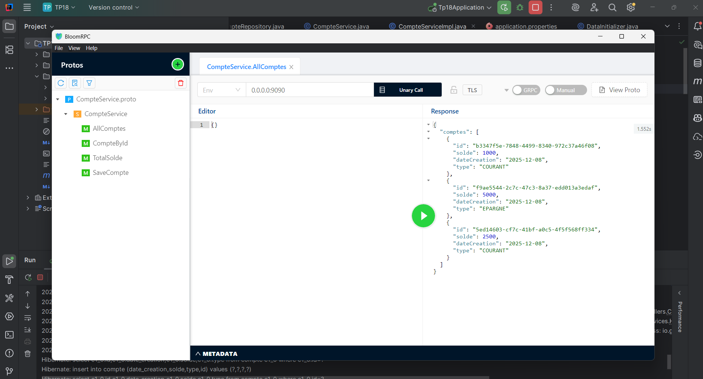
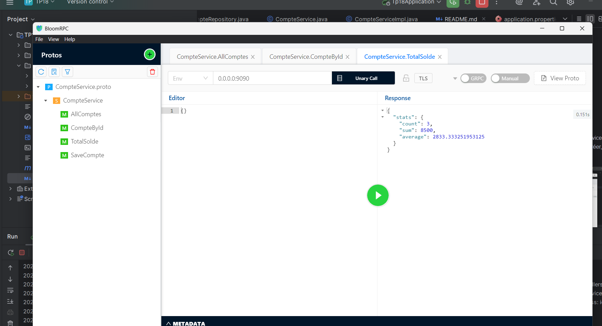
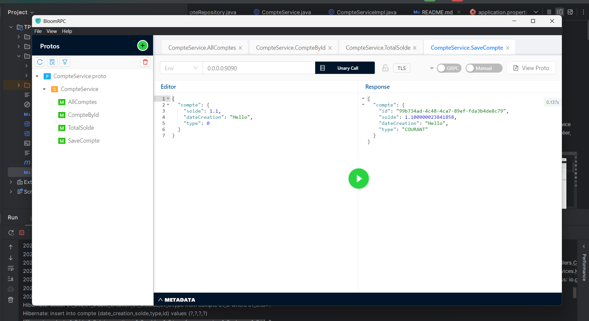

# Service gRPC de Gestion de Comptes Bancaires

## 📋 Description

Ce projet est une application Spring Boot qui expose un service gRPC pour la gestion de comptes bancaires. Il permet de créer, consulter et gérer des comptes avec leurs soldes.







## 🛠️ Technologies Utilisées

- **Java 20**
- **Spring Boot 4.0.0**
- **gRPC** (Google Remote Procedure Call)
- **Protocol Buffers (Protobuf)** - pour la sérialisation des données
- **Spring Data JPA** - pour la persistance des données
- **H2 Database** - base de données en mémoire
- **Lombok** - pour réduire le code boilerplate
- **Maven** - gestion des dépendances

## 📁 Structure du Projet

```
TP18/
├── src/
│   ├── main/
│   │   ├── java/com/example/tp18/
│   │   │   ├── config/           # Configuration de l'application
│   │   │   ├── controllers/      # Implémentation du service gRPC
│   │   │   ├── entities/         # Entités JPA
│   │   │   ├── repositories/     # Repositories Spring Data
│   │   │   ├── services/         # Couche service
│   │   │   └── Tp18Application.java
│   │   ├── proto/
│   │   │   └── CompteService.proto  # Définition du service gRPC
│   │   └── resources/
│   │       └── application.properties
│   └── test/
├── target/
│   └── generated-sources/protobuf/  # Classes générées par Protobuf
├── pom.xml
└── README.md
```

## 🔧 Configuration

### Fichier `application.properties`

```properties
spring.application.name=TP18

# gRPC Configuration
grpc.server.port=9090

# H2 Database Configuration
spring.datasource.url=jdbc:h2:mem:testdb
spring.datasource.driver-class-name=org.h2.Driver
spring.datasource.username=sa
spring.datasource.password=
spring.jpa.database-platform=org.hibernate.dialect.H2Dialect
spring.h2.console.enabled=true
spring.jpa.hibernate.ddl-auto=update
spring.jpa.show-sql=true
```

## 📡 Service gRPC

### Définition du Service (CompteService.proto)

Le service expose les opérations suivantes :

| Méthode | Description |
|---------|-------------|
| `AllComptes` | Récupère tous les comptes |
| `CompteById` | Récupère un compte par son ID |
| `TotalSolde` | Calcule les statistiques de solde (count, sum, average) |
| `SaveCompte` | Crée un nouveau compte |

### Types de Données

#### Compte
```protobuf
message Compte {
    string id = 1;
    float solde = 2;
    string dateCreation = 3;
    TypeCompte type = 4;
}
```

#### TypeCompte (Enum)
- `COURANT` - Compte courant
- `EPARGNE` - Compte épargne

#### SoldeStats
```protobuf
message SoldeStats {
    int32 count = 1;     // Nombre total de comptes
    float sum = 2;       // Somme des soldes
    float average = 3;   // Moyenne des soldes
}
```

## 🚀 Démarrage

### Prérequis

- JDK 20 ou supérieur
- Maven 3.x

### Compilation et Exécution

1. **Cloner le projet**
   ```bash
   git clone <url-du-repo>
   cd TP18
   ```

2. **Compiler le projet** (génère également les classes Protobuf)
   ```bash
   ./mvnw clean compile
   ```

3. **Lancer l'application**
   ```bash
   ./mvnw spring-boot:run
   ```

Le serveur gRPC démarrera sur le port **9090**.

## 🧪 Test du Service

### Avec grpcurl

```bash
# Lister les services disponibles
grpcurl -plaintext localhost:9090 list

# Récupérer tous les comptes
grpcurl -plaintext localhost:9090 CompteService/AllComptes

# Récupérer un compte par ID
grpcurl -plaintext -d '{"id": "1"}' localhost:9090 CompteService/CompteById

# Créer un nouveau compte
grpcurl -plaintext -d '{"compte": {"solde": 1000.0, "dateCreation": "2025-12-08", "type": "COURANT"}}' localhost:9090 CompteService/SaveCompte

# Obtenir les statistiques de solde
grpcurl -plaintext localhost:9090 CompteService/TotalSolde
```

### Avec BloomRPC ou Postman

Vous pouvez également utiliser des outils graphiques comme **BloomRPC** ou **Postman** pour tester les endpoints gRPC.

## 📊 Base de Données

L'application utilise **H2** comme base de données en mémoire. La console H2 est accessible à :
- URL : `http://localhost:8080/h2-console`
- JDBC URL : `jdbc:h2:mem:testdb`
- Username : `sa`
- Password : *(vide)*

## 📝 Entité Compte

| Champ | Type | Description |
|-------|------|-------------|
| id | String | Identifiant unique (UUID) |
| solde | float | Solde du compte |
| dateCreation | String | Date de création |
| type | String | Type de compte (COURANT/EPARGNE) |

## 👨‍💻 Auteur

ACHRAF

## 📄 Licence

Ce projet est réalisé dans le cadre d'un TP académique.

